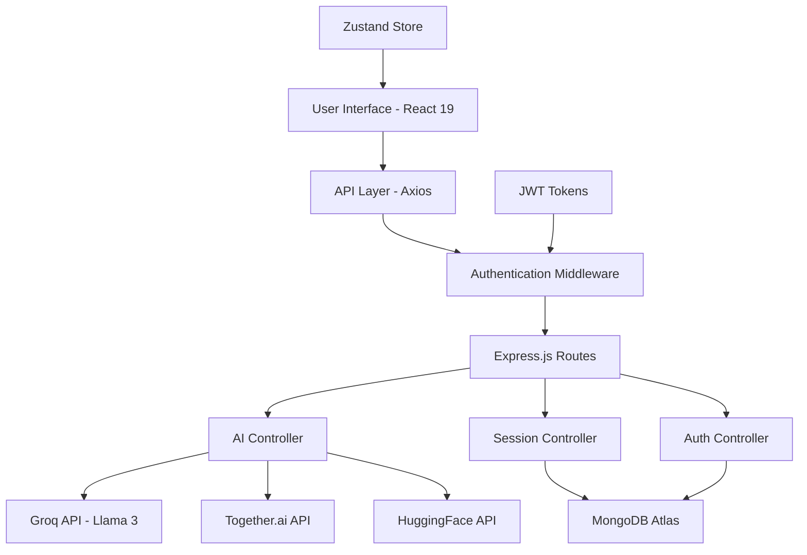

# 🌟 Echoes - AI-Powered Grief Companion & Healing Platform

<div align="center">
    
  **A compassionate AI companion that helps people find closure and healing through personalized conversations**

[](https://echoes-beta.vercel.app)
[](https://echoes-b18n.onrender.com)
[](https://linkedin.com/in/nishatayub)


</div>

---

## 🎯 Project Overview

**Echoes** is a full-stack web application that provides a safe, AI-powered space for people to process grief, express unspoken words, and find emotional closure. Built with modern technologies and empathetic AI, it helps users heal through personalized conversations and memory sharing.

### 🎨 **The Problem It Solves**
- Provides accessible mental health support through AI companionship
- Offers a safe space for processing difficult emotions
- Helps users find closure with loved ones they've lost
- Creates personalized healing experiences based on individual memories and relationships

### 🏆 **Technical Achievement**
- **Full-stack development** with React 19 + TypeScript frontend and Node.js backend
- **AI integration** using multiple providers (Groq, HuggingFace, Together.ai)
- **Real-time state management** with optimistic UI updates
- **Secure authentication** with JWT and bcrypt
- **Production deployment** on Vercel (frontend) and Render (backend)

---

## ✨ Key Features

### 🔐 **Authentication & Security**
- JWT-based authentication with secure password hashing
- Protected routes with automatic token refresh
- User session persistence with Zustand state management
- CORS protection and environment-based configurations

### 💭 **AI-Powered Conversations**
- **Multi-provider AI integration**: Groq (Llama 3), Together.ai, HuggingFace
- **Context-aware responses** based on user memories and conversation history
- **Emotion detection** and sentiment analysis for empathetic interactions
- **Intelligent fallbacks** ensuring users always receive meaningful responses

### 📝 **Memory & Session Management**
- **Memory Builder**: Users can share cherished memories and thoughts
- **Session Persistence**: Save and continue multiple conversation threads
- **Real-time updates** with optimistic UI for smooth user experience
- **Data privacy**: User-specific session isolation and encrypted storage

### 💌 **Personalized Closure Letters**
- AI-generated letters incorporating user memories and conversation themes
- PDF export functionality for saving and sharing
- Customizable letter templates based on relationship type
- Healing-focused content designed to promote emotional closure

---

## 🛠️ Technical Stack

<div align="center">

### **Frontend Architecture**


### **Backend Architecture**


### **AI & Deployment**


</div>

### **Detailed Technology Breakdown**

#### **Frontend (React TypeScript)**
- **React 19** with latest features and TypeScript for type safety
- **Vite** for lightning-fast development and optimized builds
- **React Router** for SPA navigation with protected routes
- **Zustand** for lightweight, performant state management
- **Bootstrap 5** with custom styling for responsive design
- **Axios** with interceptors for API communication and error handling
- **React Icons** for beautiful, consistent iconography

#### **Backend (Node.js/Express)**
- **Express.js** with RESTful API architecture
- **MongoDB & Mongoose** for flexible data modeling
- **JWT authentication** with middleware protection
- **bcrypt** for secure password hashing
- **CORS configuration** for cross-origin security
- **Environment-based configurations** for different deployment stages

#### **AI Integration**
- **Groq API** with Llama 3 models for high-quality conversations
- **Together.ai** for alternative AI model access
- **HuggingFace Transformers** for sentiment analysis
- **Multiple fallback strategies** ensuring reliable AI responses
- **Context building** for personalized, memory-aware conversations

---

## 🏗️ Architecture



### **Key Architectural Decisions**

1. **Microservice-Ready Structure**: Modular backend with separate controllers and services
2. **State Management**: Zustand for minimal boilerplate and excellent TypeScript support
3. **AI Abstraction**: Service layer that handles multiple AI providers with intelligent fallbacks
4. **Security-First**: JWT authentication, CORS protection, and environment-based configurations
5. **Real-time UX**: Optimistic UI updates with backend synchronization

---

## 🚀 Live Demo

### **🌐 Try It Live**
- **Frontend**: [https://echoes-beta.vercel.app](https://echoes-beta.vercel.app)
- **Backend API**: [https://echoes-b18n.onrender.com](https://echoes-b18n.onrender.com)

### **🔐 Test Account**
Feel free to register a new account or use the demo to explore the features!

---

## 💻 Local Development

### **Prerequisites**
- Node.js 18+ 
- MongoDB (local or Atlas)
- Git

### **🚀 Quick Start**

```bash
# Clone the repository
git clone https://github.com/nishatayub/Echoes.git
cd Echoes

# Install dependencies
npm run install:all  # Installs both client and server dependencies

# Set up environment variables
cp server/.env.example server/.env
cp client/.env.development.example client/.env.development

# Start development servers
npm run dev  # Starts both frontend and backend concurrently
```

### **🔧 Environment Configuration**

#### **Server (.env)**
```env
PORT=8080
MONGODB_URI=mongodb://localhost:27017/echoes
JWT_SECRET=your-super-secret-jwt-key
NODE_ENV=development

# AI API Keys (get free accounts)
GROQ_API_KEY=your_groq_api_key
TOGETHER_API_KEY=your_together_api_key
HUGGINGFACE_API_KEY=your_huggingface_api_key

FRONTEND_URL=http://localhost:5173
```

#### **Client (.env.development)**
```env
VITE_API_BASE_URL=http://localhost:8080/api
```

### **📦 Available Scripts**

```bash
# Development
npm run dev              # Start both frontend and backend
npm run client:dev       # Start frontend only
npm run server:dev       # Start backend only

# Building
npm run build           # Build frontend for production
npm run client:build    # Build frontend only
npm run server:build    # Prepare backend for deployment

# Testing
npm run test            # Run all tests
npm run client:test     # Run frontend tests
npm run server:test     # Run backend tests
```

---

## 🤖 AI Implementation

### **Multi-Provider AI Strategy**

```javascript
// AI Service Architecture
class AIService {
  async generateResponse() {
    try {
      // 1. Primary: Groq API (Llama 3) - Fast & Reliable
      return await this.tryGroqAPI();
    } catch {
      try {
        // 2. Fallback: Together.ai - Alternative models
        return await this.tryTogetherAPI();
      } catch {
        try {
          // 3. Fallback: HuggingFace - Open source models
          return await this.tryHuggingFaceAPI();
        } catch {
          // 4. Final: Contextual response patterns
          return await this.generateContextualResponse();
        }
      }
    }
  }
}
```

### **Context-Aware Conversations**

- **Memory Integration**: AI responses incorporate user's shared memories
- **Emotion Detection**: Sentiment analysis guides response tone and content
- **Conversation History**: Maintains context across multiple messages
- **Relationship Awareness**: Adapts language based on relationship type (family, friend, pet, etc.)

### **AI Features**

1. **Intelligent Response Generation**
   - Context-aware conversations based on memories and history
   - Emotion-appropriate responses with empathy
   - Therapeutic language patterns for healing

2. **Sentiment Analysis**
   - Real-time emotion detection in user messages
   - Adaptive AI personality based on emotional state
   - Support escalation for crisis situations

3. **Personalized Letter Generation**
   - AI-crafted closure letters incorporating conversation themes
   - Memory-based personalization
   - Healing-focused content for emotional closure

---

## 🔧 Technical Highlights

### **Advanced React Patterns**
- **Custom Hooks** for AI conversation management
- **Context API** for authentication state
- **Error Boundaries** for graceful error handling
- **Optimistic UI** for real-time chat experience
- **Code Splitting** for performance optimization

### **Backend Excellence**
- **Middleware Architecture** for authentication and error handling
- **RESTful API Design** with consistent response patterns
- **Database Optimization** with proper indexing and relationships
- **Security Best Practices** with JWT, CORS, and input validation
- **Scalable File Structure** ready for microservices

### **DevOps & Deployment**
- **Environment-Based Configuration** for different stages
- **Automated Deployment** with Vercel and Render
- **Error Monitoring** and logging for production debugging
- **Performance Optimization** with lazy loading and caching

---

## 🤝 Contributing

We welcome contributions! Please see our [Contributing Guidelines](CONTRIBUTING.md) for details.

### **Development Workflow**
1. Fork the repository
2. Create a feature branch (`git checkout -b feature/amazing-feature`)
3. Commit your changes (`git commit -m 'Add amazing feature'`)
4. Push to the branch (`git push origin feature/amazing-feature`)
5. Open a Pull Request

---

## 📄 License

This project is licensed under the MIT License - see the [LICENSE](LICENSE) file for details.

---

### **Skills Demonstrated**
- Full-stack web development (React, Node.js, MongoDB)
- AI/ML integration and API management
- TypeScript for type-safe development
- Modern state management (Zustand)
- Authentication and security implementation
- Cloud deployment and DevOps (Vercel, Render)
- Responsive UI/UX design
- RESTful API design and development

---

<div align="center">

**⭐ If you found this project helpful, please give it a star! ⭐**

**Echoes - Where healing conversations begin** 💙

[](https://github.com/nishatayub/Echoes)
[](https://github.com/nishatayub)

</div>
